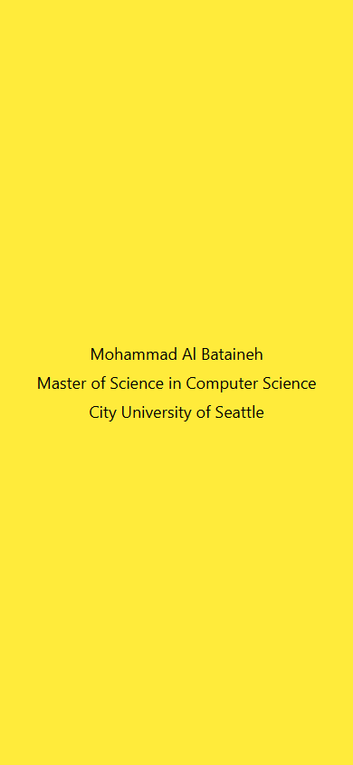

# cs624-pe-Mohammad

Programming exercises for CS624 Full-Stack Development Mobile App, City University of Seattle.
Each exercise lives in its own top-level directory.

## Exercises

| Directory | Description |
| --- | --- |
| [PE01-HelloWorld](PE01-HelloWorld) | React Native + Expo "Hello World" app displaying name, degree program, and school on a yellow background. |

## Screenshot

See [PE01-HelloWorld/README.md](PE01-HelloWorld/README.md) for the input-process-output
analysis and setup instructions for that exercise.
